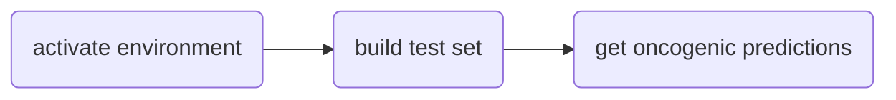

# ChimerDriver
A machine learning tool that assesses the oncogenic potential of gene fusions.

conda create --name ChiTest python=3.6.12
conda activate Chitest
python -m pip install --upgrade pip
python -m pip install -r requirements.txt

git clone https://github.com/veneresabrina/ChimerDriver.git
cd ChimerDriver
unzip processed_db.zip


python ChimerDriver.py build train_test_sets train_test_sets/mytest.csv test N
python ChimerDriver.py load_test_model train_test_sets train_test_sets/mytest.csv train_test_sets/feat_selall.txt best_model.h5




## Citation

Please cite the following paper if this code was useful for your research:


Download from here (PDF): 

```
@article{,
    author =       "",
    title =        "{}",
    booktitle =    "{},
    pages =        "",
    year =         "",
}

```
## Prerequisites
The code is tested under Python 3.6.12 with TensorFlow (GPU) 2.2.0 and Keras 2.4.3. backend, Intel(R) Core(TM) i7-8700 CPU @ 3.20GHz
The environment can be created with conda by entering the following commands:
```
conda create --name ChimerDriver python=3.6.12 
conda activate ChimerDriver
conda install -c conda-forge pandas=1.1.5
conda install -c conda-forge scikit-learn=0.23.2
conda install -c conda-forge keras=2.4.3
conda install -c conda-forge matplotlib=3.3.2
```
The above requirements are also listed in the requirements.txt files.

## Directory structure and files
```
ChimerDriver.py -> main code
ChimerDriver_tools.py -> python module containing all the necessary functions to run the main code
processed_db.zip:
    gene_attribute_matrix.csv -> database containing the transcription factors for each gene
    gene_attribute_matrix_info_biomart.txt -> database containing the gene ontologies for each gene
    miRNA_gene_matrix.csv -> database containing the microRNA probabilities for each gene
    cancermine.csv -> database for the roles of genes, either driver, tumor suppressor, oncogenic or other
```
## Installation
After successfully creating the working environment unzip the *processed_db.zip* folder. 
The four pre-processed databases should be in the same directory as the main code and the python module.

In order to replicate the experiments with the provided dataset the first step is creating the features for the training and test sets as described in the subsection "Build features".

Next, it is possible to either cross-validate the model or test it on the provided testing set as described in the subsections below. 


#### Build the features
The features for the training set and the test set must be constructed using the following four arguments: 
- "build"
- "file.csv"
- "train/train_again/test" - train if the set will serve as a training set, train_again if the dataset will be merged with a previously built train set and will serve as a trainig set, test otherwise
- "1/0/N" - 1 if the label of the entire dataset is positive (e.g oncogenic gene fusion), 0 if it is negative, N if the "Label" column is already provided in the dataset or if it is not provided
Note: the training set must be built before any of the testing sets
```
Build the training set features -> python ChimerDriver.py build DEEPrior_data/training_set.csv train N
Build the validation set features -> python ChimerDriver.py build DEEPrior_data/test_set_1.csv test N
Build the test set features -> python ChimerDriver.py build DEEPrior_data/test_set.csv test N
```
The files processed with Starfusion should be handled accordingly to test the model performances:
```
python ChimerDriver.py build use_case_breast_prostate/training_set.csv train N
python ChimerDriver.py build use_case_breast_prostate/X_SRR064286.csv test 1
python ChimerDriver.py build use_case_breast_prostate/X_SRR064287.csv test 1
python ChimerDriver.py build use_case_breast_prostate/X_SRR064438.csv test 1
python ChimerDriver.py build use_case_breast_prostate/X_SRR064439.csv test 1
python ChimerDriver.py build use_case_breast_prostate/X_SRR064440.csv test 1
python ChimerDriver.py build use_case_breast_prostate/X_SRR064441.csv test 1
python ChimerDriver.py build use_case_breast_prostate/X_SRR496597.csv test 1
python ChimerDriver.py build use_case_breast_prostate/X_SRR496595.csv test 1
python ChimerDriver.py build use_case_breast_prostate/X_SRR496481.csv test 1
```
#### Cross-validation
To cross validate the model with 10-fold cross validation on the provided training set the command line takes the following arguments:
- "cross_val_model"
- "working_folder_name"
- "trainset.csv" - separated by "+" in case of multiple training sets
- "testset.csv" - separated by "+" in case of multiple testing sets
- "valset.csv" - separated by "+" in case of multiple validation sets
- "num_epochs" - max number of training epochs
- "forest/subset/subset_forest/load" - either use the random forest selection to reduce the number of features, use a subset of features or combine the two to obtain a feature set made of the selected databases and reduced by the random forest method. In alternative an already created feature set can be loaded by specifying the name_feature_set used previously (see next command line argument)
- "5/TF/GO/miRNA/5_TF/5_miR/5_GO/TF_miR/GO_TF/GO_miR/5_TF_miR/5_GO_miR/5_GO_TF/5_GO_TF_miR/name_feature_set" - pick the features from the transcription factor database (TF), the gene ontologies database (GO), the microRNA database (miRNA), the structural features set (5) or any provided combination of these sets. When no particular combination of feature sets is needed (cases "forest" and "load") any feature set name is allowed. The features will be stored in a text file named with the specified keyword.
- "forest_thresh" - threshold for the random forest feature selection
- "lr" - learning rate
- "dropout" - dropout value

Train the model on training_set.csv, validate it using the samples in test_set_1.csv. The maximum possible training epochs is 3000, the model uses the random forest selection method on the complete set of features with a threshold of 0.0005. The learning rate is 0.01 and the dropout is 0.2
```
python ChimerDriver.py cross_val_model DEEPrior_data DEEPrior_data/training_set.csv DEEPrior_data/test_set.csv DEEPrior_data/test_set_1.csv 3000 forest all_feat 0.0005 0.01 0.2
```
Repeat the previous step using the same features but different parameters, for example a dropout value of 0.4.
```
python ChimerDriver.py cross_val_model DEEPrior_data DEEPrior_data/training_set.csv DEEPrior_data/test_set.csv DEEPrior_data/test_set_1.csv 3000 load all_feat 0.0005 0.01 0.4
```

Train the model on training_set.csv, validate it using the samples in test_set_1.csv. The maximum possible training epochs is 1000, the model uses the transcription factor features only. The learning rate is 0.001 and the dropout is 0.1
```
python ChimerDriver.py cross_val_model DEEPrior_data DEEPrior_data/training_set.csv DEEPrior_data/test_set.csv DEEPrior_data/test_set_1.csv 1000 subset TF 0.0005 0.001 0.1
```
Train the model on training_set.csv, validate it using the samples in test_set_1.csv. The maximum possible training epochs is 1000, the model uses all the features except for the miRNAs and reduces the number of features with a random forest characterized by a threshold equal to 0.0005. The learning rate is 0.001 and the dropout is 0
```
python ChimerDriver.py cross_val_model DEEPrior_data DEEPrior_data/training_set.csv DEEPrior_data/test_set.csv DEEPrior_data/test_set_1.csv 1000 subset 5_GO_TF 0.0005 0.001 0
```


#### Training and Testing
The command line arguments are the same used for the training phase with the exception of the first one which will be "train_test_model" instead of "cross_val_model".

Test the model using the prostate and breast samples provided in the *use_cases_brest_prostate* folder. Train the model on training_set.csv, test it on the samples belonging to the SRR***.csv files listed below. No samples provided to validate the model during training therefore the training will stop after 500 epochs. Each subset of feature is considered and the number of features is reduced with the random forest characterized by a threshold of 0.0005. The learning rate is 0.001 and the dropout is 0.2.
```
python ChimerDriver.py train_test_model use_cases_breast_prostate use_cases_breast_prostate/training_set.csv use_cases_breast_prostate/X_SRR064286.csv+use_cases_breast_prostate/X_SRR064287.csv+use_cases_breast_prostate/X_SRR064438.csv+use_cases_breast_prostate/X_SRR064439.csv+use_cases_breast_prostate/X_SRR064440.csv+use_cases_breast_prostate/X_SRR064441.csv+use_cases_breast_prostate/X_SRR496597.csv+use_cases_breast_prostate/X_SRR496595.csv+use_cases_breast_prostate/X_SRR496481.csv . 500 forest all 0.0005 0.001 0.2
```


#### Load and Test
To load an existing model and use it to test a dataset the following command line arguments are needed:
-"load_test_model"
-"working_folder_name" - the name of the folder you are working in, this is where the dataset is and the results will be saved in
-"testset.csv"
-"feature_selected_to_load_filename" - the filename of txt file of the feature set used by the model you are testing
-"model_to_load_filename" - the filename of the .h5 file of the model you are testing

```
python ChimerDriver.py load_test_model DEEPrior_data DEEPrior_data/test_set.csv DEEPrior_data/featsel_all.txt DEEPrior_data/trained_model_lr0.01_nodes_dropout0.2512-256-128-64_actfuncrelu-tanh-relu-tanh.h5

```
Please note that before testing a new dataset it is needed to perform the "build" step to obtain the required features in the correct format.

